# 一次内存问题修复的流水账记录

先简单的介绍一下项目的情况，后台管理项目，layui + jQuery。接手的时候已经基本完成，主要做一些支持性、维护性的工作。

月初的时候，根据需求修改了导出 excel 功能，从：
```javascript
async function exportExcel() {
    const ids = await api.getRecordIDs(userIDs)
    const sheet = []
    for (let i = 0;i < ids.length; i++) {
        const data = await api.getRecord(ids[i])
        sheet.push(format(data))
    }
    excel.export(sheet)
}
```

改成了：
```javascript
async function exportExcel() {
    const records = await api.getRecords(userIDs)
    const sheet = []
    for (let i = 0;i < records.length; i++) {
        sheet.push(format(records[i]))
    }
    excel.export(sheet)
}
```

简单测试之后，部署到了线上。

一周后，用户报告导出功能无法使用，具体表现为：导出即将完成时页面崩溃，同时CPU、内存都被占满。

一开始，怀疑是用户的电脑硬件配置低、与导出插件冲突，就把插件从 1.6.2 升级到了 1.7.2 ，但是没有用，问题依然存在。于是在插件的演示地址尝试导出20万行、9列的模拟数据，同时观察系统资源使用情况。
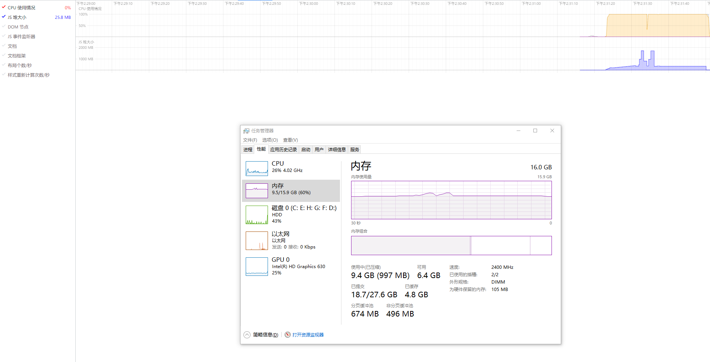
从上图看，占用并不高，排除了插件的嫌疑。

导出100条数据，并使用开发者工具录制性能分析数据：
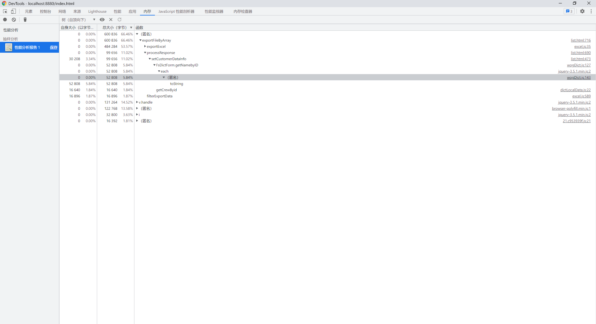
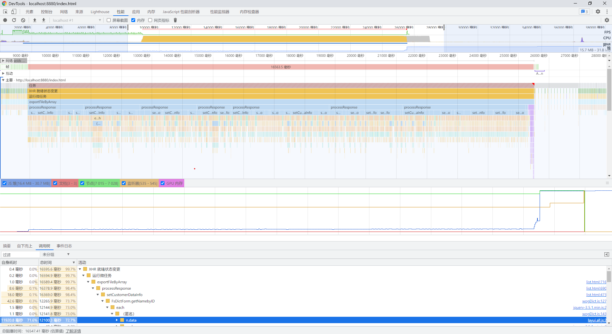
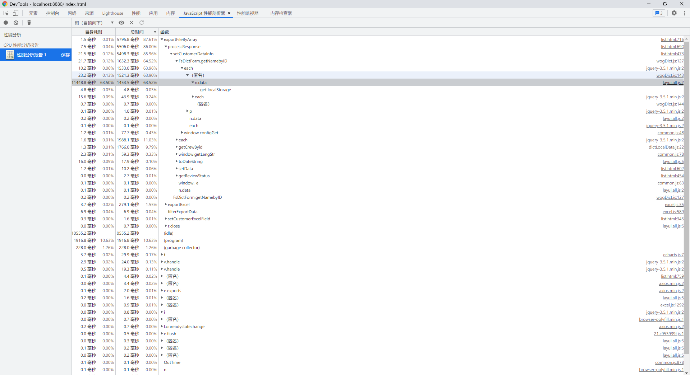
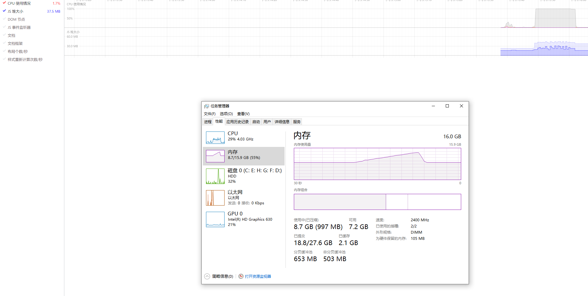

确定嫌疑代码：

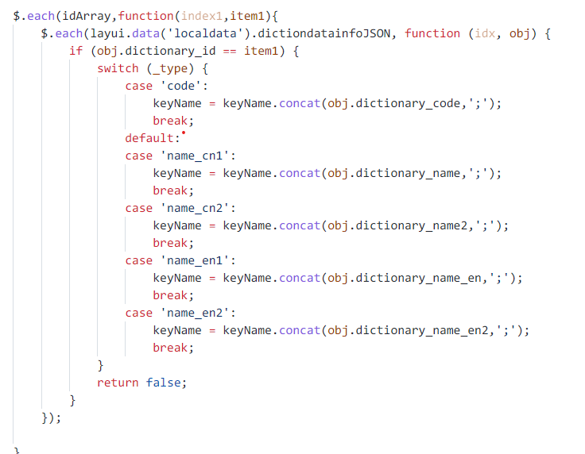

把`layui.data`的调用移到最外面试试：
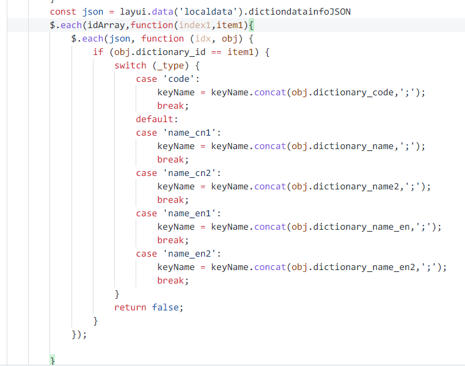
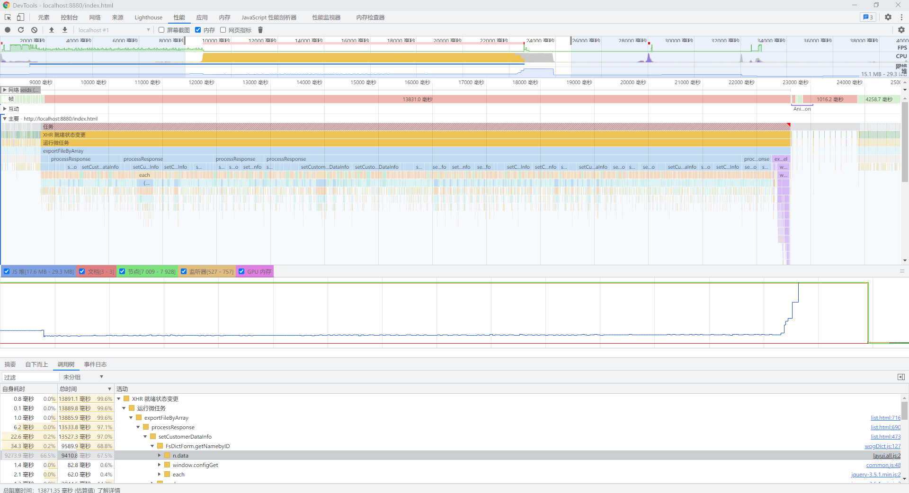
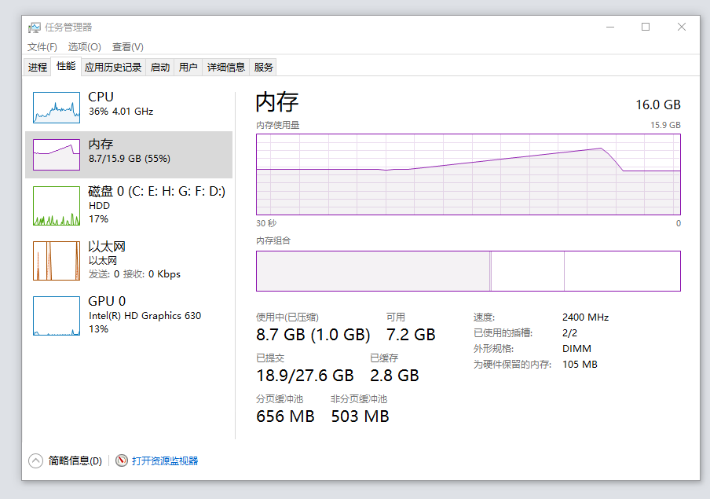  
依然存在问题。

弃用`layui.data`改用原生`lcoalStorage`：
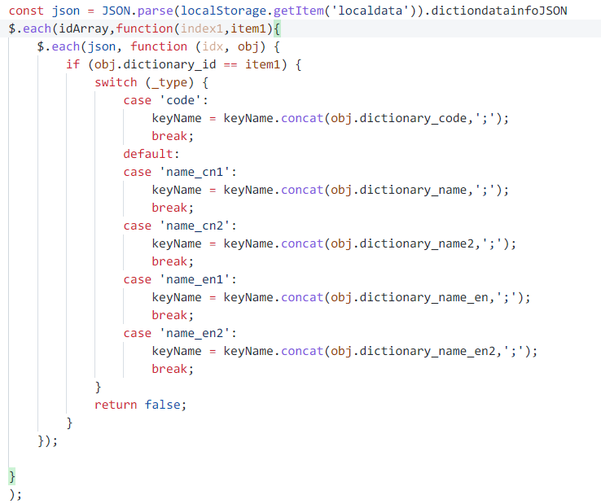
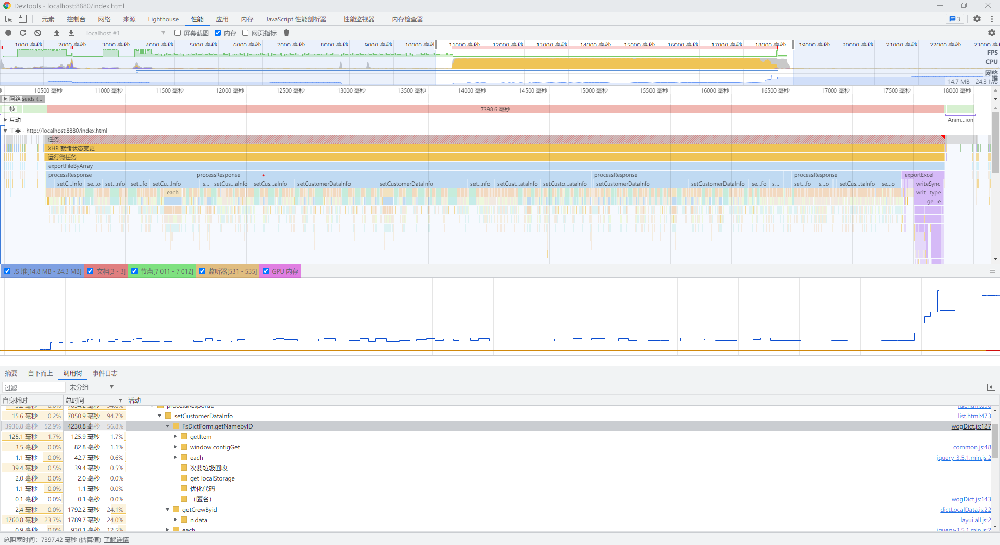
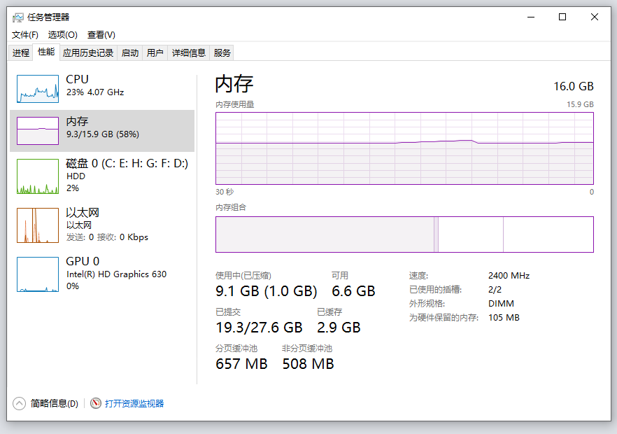

看着好像没问题了，模拟个4000行的数据试试：
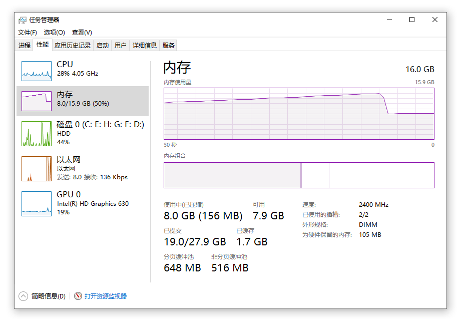


把`localStorage`的调用移动到页面里，同时在页面里复制一个专用的`getNameByID`方法，模拟导出4000条，占用：
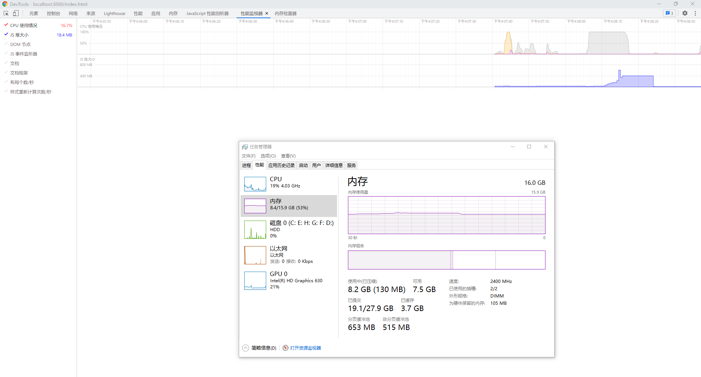
耗时：  


一番测试下来，最终版本的极限在28000条，数量再大就会报 *STATUS_BREAKPOINT* 错误。
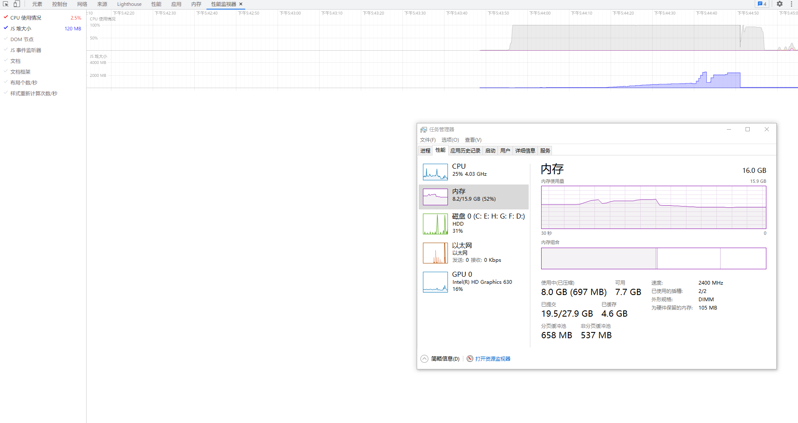

一番折腾下来，深切感受到自己的鶸，对于边界情况的预计不够敏锐、完善。
